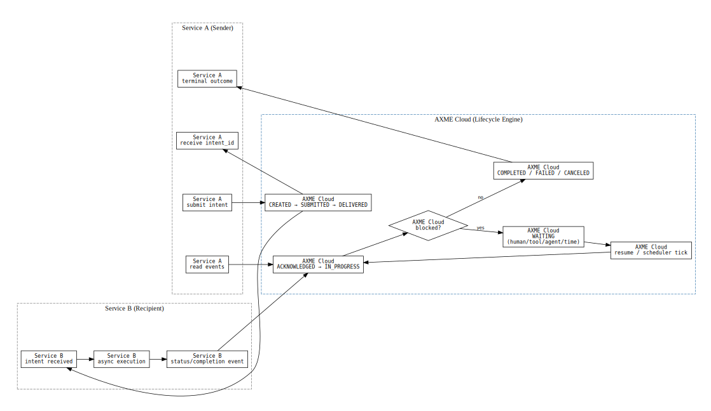
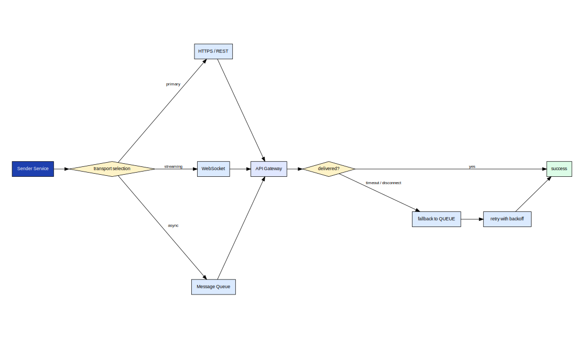
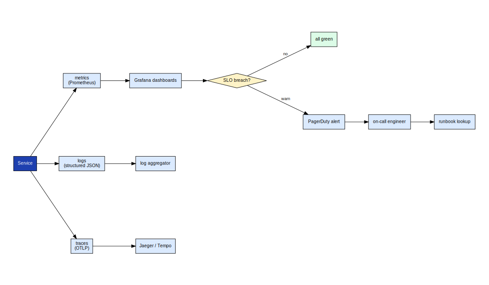

# axme-examples

**Reference examples and starter templates for the AXME platform.** Runnable, well-commented code showing how to integrate AXME across Python, TypeScript, Go, Java, and .NET — organized by use case, not by language.

> **Alpha** · Examples are being added in waves alongside the platform. Check back often.  
> Requests for specific examples → [hello@axme.ai](mailto:hello@axme.ai)

---

## What This Repository Is For

`axme-examples` is the fastest way to go from "I have an API key" to "I have working code." Each example is:

- **Runnable** — copy, fill in your API key, and run
- **Self-contained** — minimal dependencies, no boilerplate to untangle
- **Annotated** — comments explain *why*, not just *what*
- **Tested** — CI validates all examples against the staging gateway

---

## Example Themes

### Intent Lifecycle Without Polling

The AXME platform delivers state transitions via SSE — you don't need to poll. Examples in this category show how to write intent-driven code that reacts to events rather than checking status in a loop.



*Each state transition triggers a real-time event. Your code subscribes once and receives `PENDING → PROCESSING → WAITING → DELIVERED → RESOLVED` transitions as they happen.*

### Transport Fallback and Retry-Safe Flows

Transport failures are handled by the platform, but your integration code should be written to handle them gracefully too. Examples here show idempotency key usage, retry-safe patterns, and how to handle `429` and `503` responses.



*The platform automatically falls back to the next available transport (HTTP → queue → manual) when delivery fails. Your webhook handler should be idempotent: the same event may arrive more than once.*

### Observability-First Async Operations

Examples showing how to instrument your AXME integration: correlation IDs, structured logging, intent lifecycle traces, and SLO-aware timeout handling.



*Best practice: propagate the `X-Correlation-Id` header from the intent through your internal service calls. This makes it possible to trace a full intent lifecycle across your stack.*

---

## Planned Example Matrix

| Use Case | Python | TypeScript | Go | Java | .NET |
|---|---|---|---|---|---|
| Send an intent (basic) | 🔜 | 🔜 | 🔜 | 🔜 | 🔜 |
| Observe events (SSE) | 🔜 | 🔜 | 🔜 | 🔜 | 🔜 |
| Human-in-the-loop approval | 🔜 | 🔜 | 🔜 | — | — |
| Retry-safe with idempotency key | 🔜 | 🔜 | 🔜 | 🔜 | 🔜 |
| Webhook receiver + signature verify | 🔜 | 🔜 | — | — | — |
| Transport fallback handling | 🔜 | 🔜 | — | — | — |

---

## Repository Status

Bootstrap phase. Examples are being built in priority order (Tier 1 first).

See [`CONTENT_ROADMAP_ALPHA.md`](CONTENT_ROADMAP_ALPHA.md) for the full plan and timeline.

---

## How to Run an Example

Once examples are available:

```bash
git clone https://github.com/AxmeAI/axme-examples.git
cd axme-examples/python/send-intent-basic

# Set your API key
export AXME_API_KEY="your-key-here"
export AXME_BASE_URL="https://gateway.axme.ai"

# Run
python example.py
```

Each example directory contains a `README.md` with specific setup instructions.

---

## Related Repositories

| Repository | Role |
|---|---|
| [axme-docs](https://github.com/AxmeAI/axme-docs) | Full API reference — examples link here for deeper context |
| [axme-sdk-python](https://github.com/AxmeAI/axme-sdk-python) | Python SDK used by Python examples |
| [axme-sdk-typescript](https://github.com/AxmeAI/axme-sdk-typescript) | TypeScript SDK |
| [axme-sdk-go](https://github.com/AxmeAI/axme-sdk-go) | Go SDK |
| [axme-sdk-java](https://github.com/AxmeAI/axme-sdk-java) | Java SDK |
| [axme-sdk-dotnet](https://github.com/AxmeAI/axme-sdk-dotnet) | .NET SDK |
| [axme-reference-clients](https://github.com/AxmeAI/axme-reference-clients) | Full reference application implementations |

---

## Contributing & Contact

- Suggest an example: open an issue with label `example-request`
- Alpha program access and integration questions: [hello@axme.ai](mailto:hello@axme.ai)
- Security disclosures: see [SECURITY.md](SECURITY.md)
- Contribution guidelines: [CONTRIBUTING.md](CONTRIBUTING.md)
