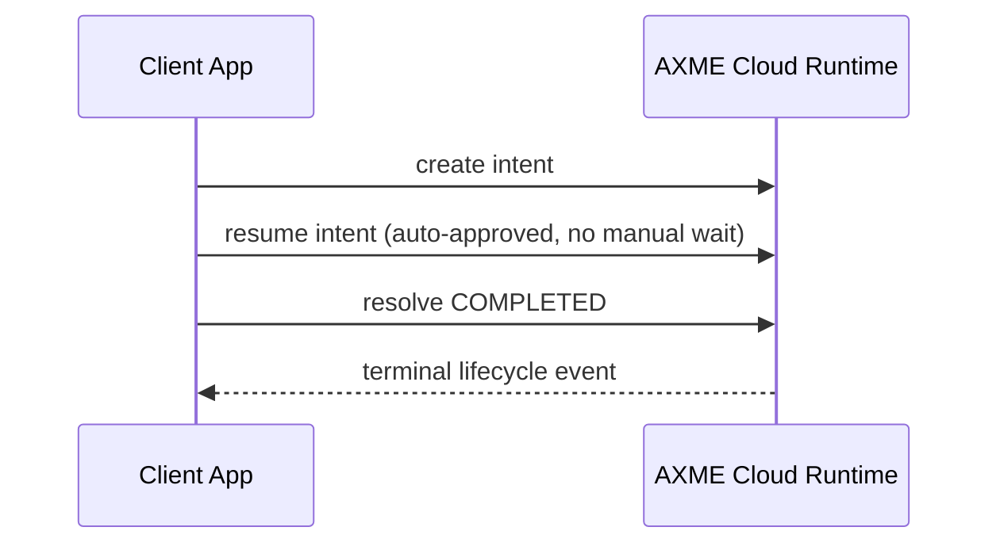

# Approval Workflow

Problem: your operation requires approval semantics, but the product path must stay fast.  
Goal: keep one durable intent lifecycle and finish without losing state.

This example demonstrates:

- intent creation (`POST /v1/intents`)
- automatic approval via immediate `resume`
- terminal completion via `resolve`
- lifecycle event observation

## Requirements

This example runs against **AXME Cloud**.

You need:

- AXME Cloud API key (generated on the landing page)
- `.env` file with `AXME_API_KEY` set (copy from `.env.example`)
- optional `AXME_BASE_URL` override (defaults to AXME Cloud endpoint)

Get API key at:

- <https://cloud.axme.ai/alpha>



## Run (Python)

```bash
cd examples/approval-workflow/python
python -m venv .venv
source .venv/bin/activate
pip install -r requirements.txt
cp ../.env.example ../.env
# edit ../.env and set AXME_API_KEY
# optional override:
# export AXME_BASE_URL="https://api.cloud.axme.ai"
python main.py
```

## Run (TypeScript)

```bash
cd examples/approval-workflow/typescript
npm install
cp ../.env.example ../.env
# edit ../.env and set AXME_API_KEY
# optional override:
# export AXME_BASE_URL="https://api.cloud.axme.ai"
npm run start
```

## Notes

- This scenario is configured as an automatic approval path.
- The example does not wait for manual/human approval.

## Additional SDK snippets

See [`../../snippets/README.md`](../../snippets/README.md).

Built using AXME (AXP).
