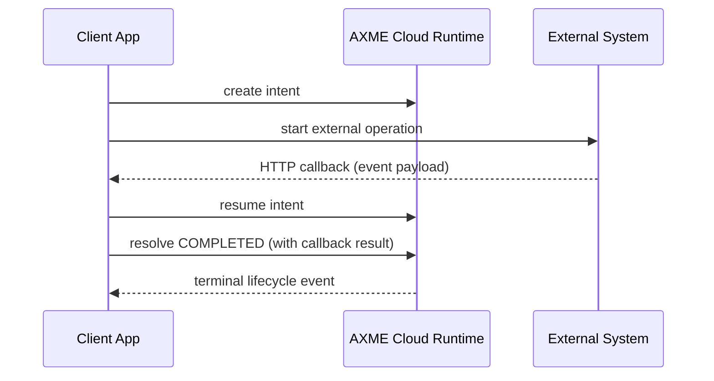

# External Callback

Problem: your flow waits for an external provider callback (payments, KYC, report generation).  
Goal: resume and complete one intent lifecycle when callback data arrives.

This example demonstrates:

- intent creation
- waiting for callback data
- callback-triggered `resume`
- terminal `resolve` with callback payload

## Requirements

This example runs against **AXME Cloud**.

You need:

- AXME Cloud API key (generated on the landing page)
- `.env` file with `AXME_API_KEY` set (copy from `.env.example`)
- optional `AXME_BASE_URL` override (defaults to AXME Cloud endpoint)

Get API key at:

- <https://cloud.axme.ai/alpha>



## Run (Python)

```bash
cd examples/external-callback/python
python -m venv .venv
source .venv/bin/activate
pip install -r requirements.txt
cp ../.env.example ../.env
# edit ../.env and set AXME_API_KEY
# optional override:
# export AXME_BASE_URL="https://api.cloud.axme.ai"
python main.py
```

## Run (TypeScript)

```bash
cd examples/external-callback/typescript
npm install
cp ../.env.example ../.env
# edit ../.env and set AXME_API_KEY
# optional override:
# export AXME_BASE_URL="https://api.cloud.axme.ai"
npm run start
```

## Notes

- By default, the script simulates an external callback (`AXME_SIMULATE_CALLBACK=true`).
- To test a real callback path, set `AXME_SIMULATE_CALLBACK=false` and `POST` JSON to the callback endpoint printed by the script.

Built using AXME (AXP).
