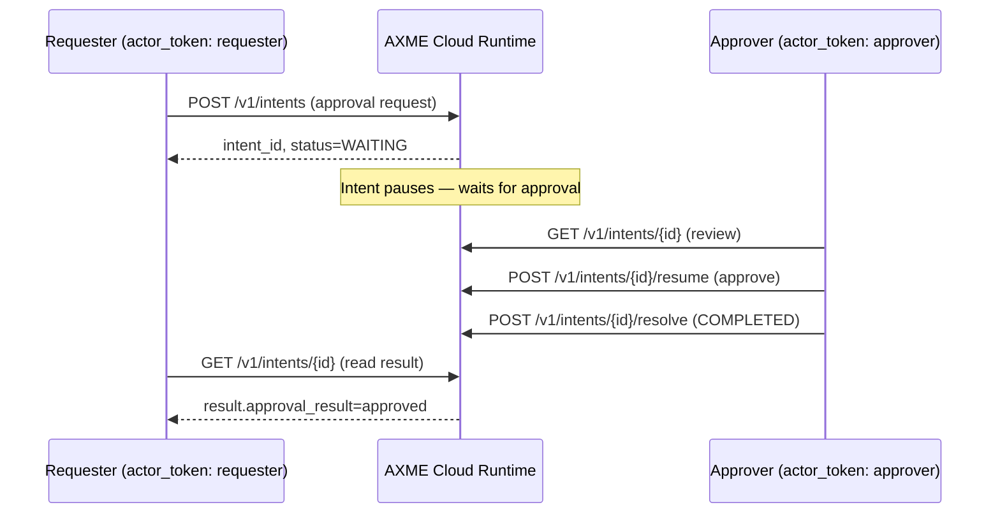

# Multi-Actor Approval

Problem: an operation requires explicit approval from a different actor (human reviewer, on-call lead, compliance officer) before execution can proceed.  
Goal: keep one durable intent lifecycle across both actors — requester and approver — without shared mutable state.

This example demonstrates:

- creating an intent that enters **WAITING** state (requires external input to proceed)
- a **second actor** using their own `actor_token` to resume the intent
- durable result recording — the approval decision is part of the lifecycle
- reading the final outcome as the original requester

## The `actor_token` Pattern

Both actors share the same `AXME_API_KEY` (workspace credential) but carry different identity tokens (`actor_token`). This is the AXP multi-actor pattern:

- **API key** = workspace access gate (which workspace you're talking to)
- **actor_token** = actor identity (who is acting within the workspace)

The durable intent lifecycle captures each actor's actions separately in the event chain — providing a full audit trail with no external coordination needed.

## Requirements

This example runs against **AXME Cloud**.

You need:

- AXME Cloud API key (generated on the landing page)
- Two JWT `actor_token` values (one per actor)
- `.env` file with `AXME_API_KEY`, `AXME_REQUESTER_TOKEN`, and `AXME_APPROVER_TOKEN` set

Get API key at:

- <https://cloud.axme.ai/alpha>



## Run (Python)

```bash
cd examples/multi-actor-approval/python
python -m venv .venv
source .venv/bin/activate
pip install -r requirements.txt
cp ../.env.example ../.env
# edit ../.env and set AXME_API_KEY, AXME_REQUESTER_TOKEN, AXME_APPROVER_TOKEN
python main.py
```

## Key Concepts

### Why two tokens for one workspace?

A single workspace represents a shared execution environment (e.g. your org's production namespace). Within it, different principals — humans, services, automated systems — can act. Each gets their own `actor_token` scoped to their identity. The workspace API key controls *access*; the actor token controls *identity*.

### The WAITING state

An intent enters `WAITING` when the runtime recognizes it cannot proceed autonomously. The intent lifecycle is preserved durably. Any authorized actor can call `resume` to unblock it — no polling loop or message queue needed.

### Audit trail

After running this example, call `GET /v1/intents/{id}/events` to see the full event chain. Both the requester's create action and the approver's resume/resolve actions appear with distinct actor identities.

## See Also

- [Approval Workflow](../approval-workflow/) — single-actor auto-approval flow
- [Multi-Service Coordination](../multi-service-coordination/) — parallel child intents
- [axme-sdk-python](https://github.com/AxmeAI/axme-sdk-python) — Python SDK reference
