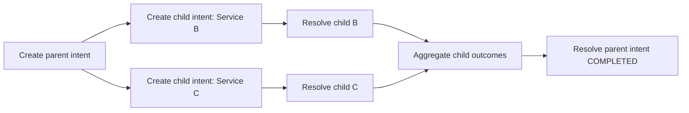

# Multi-Service Coordination

Problem: one business operation requires multiple services and ordered completion.  
Goal: keep one parent intent lifecycle while coordinating child service work.

This example demonstrates:

- parent intent for orchestration context
- child intents for service B and service C
- child completion aggregation
- parent completion with merged result

## Requirements

This example runs against **AXME Cloud**.

You need:

- AXME Cloud API key (generated on the landing page)
- `.env` file with `AXME_API_KEY` set (copy from `.env.example`)
- optional `AXME_BASE_URL` override (defaults to AXME Cloud endpoint)

Get API key at:

- <https://cloud.axme.ai/alpha>



## Run (Python)

```bash
cd examples/multi-service-coordination/python
python -m venv .venv
source .venv/bin/activate
pip install -r requirements.txt
cp ../.env.example ../.env
# edit ../.env and set AXME_API_KEY
# optional override:
# export AXME_BASE_URL="https://api.cloud.axme.ai"
python main.py
```

## Run (TypeScript)

```bash
cd examples/multi-service-coordination/typescript
npm install
cp ../.env.example ../.env
# edit ../.env and set AXME_API_KEY
# optional override:
# export AXME_BASE_URL="https://api.cloud.axme.ai"
npm run start
```

Built using AXME (AXP).
